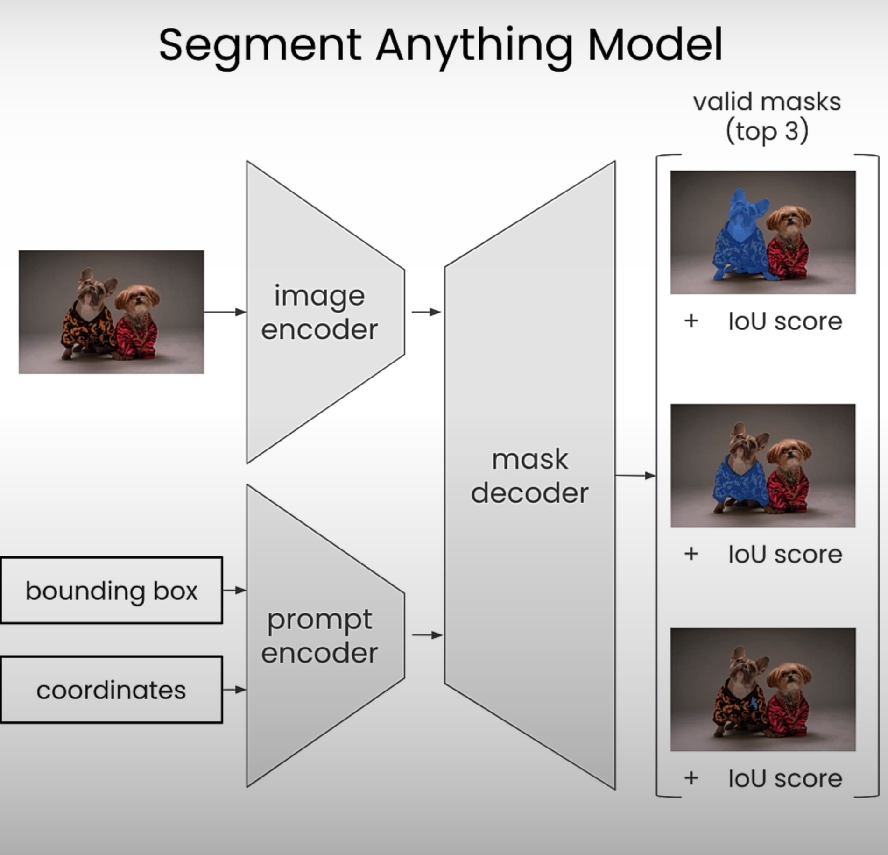
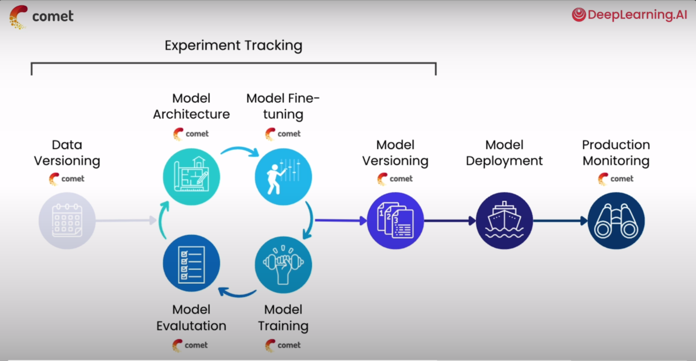

# l-imagination

Notes on LLM's for Vision Models

## What is a Prompt?

A prompt is simply an input that guide the sampling distribution of the output. Not only text can be a prompt, but also images, sounds, etc.

Each of these data type will be converted into a numerical representation before being fed to the machine learning model. Ultimately, these intputs will be further processed into embeddings to compute and save on space.

## What is an embedding?

An embedding is a relatively low dimensional space representation into which you can translate high dimensional vectors.

## What is visual prompting?

Visual prompting is a technique of interacting with LLM models to perform specific tasks that it might not necessarily have been explicitly trained to do.

## Prompt Engineering workflow vs Traditional Machine learning workflow

ML traditional workflows relies on training, testing and iteration.

In Prompt engineering workflow, you don't have trainning at all, but you focus in finding the optimal combination of settings, input data and prompts in order to get the desired output. So the main workflow is:

**Prompt -> Inference -> tunning prompt**

## Vision Prompting tasks

1. Image segmentation: use a tool (SAM Segment Anything Model) to segment images usings as prompts: pixel coordinates, bounding boxes, etc.

2. Object detection: Detect objects within images using natural language (OWL-VIT, SAM)

3. Image generation: Use natural language to create areas of an image that didn't previously exist (With Stable Diffusion).

4. Fine-tuning: How to fine-tune an image generation model on your own custion images. 

## Image segmentation

### Main idea

Ver *course/01_image_segmentation*.

## Zero Shoot object detection

ver *course/02_image_detection*

## Relevant Images

### Complete image on ML workflow

